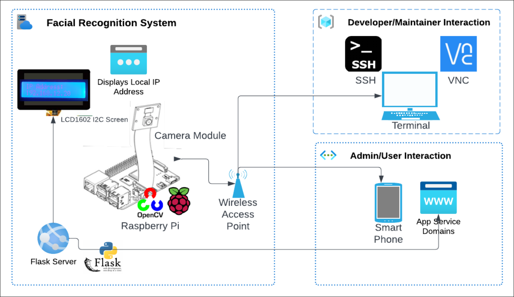
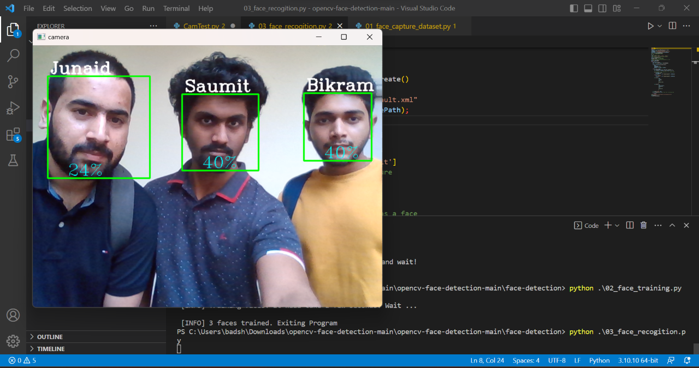
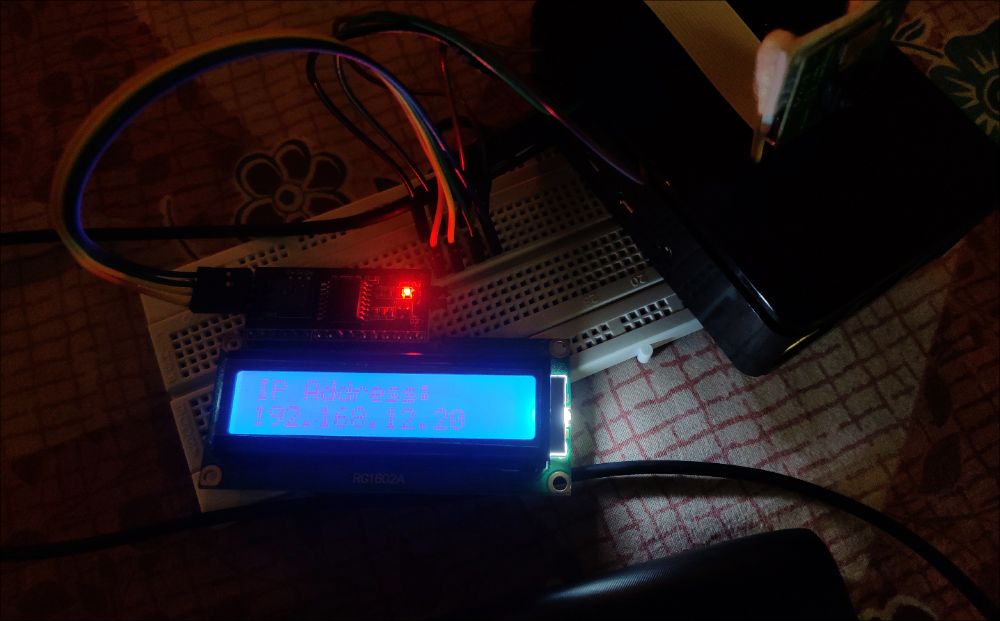
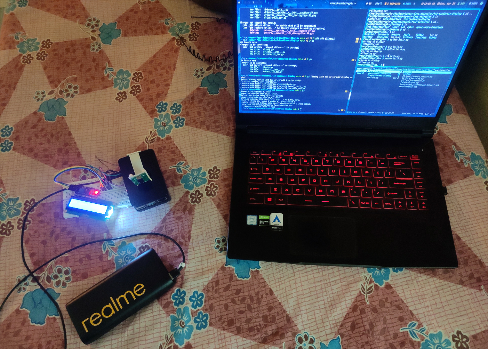
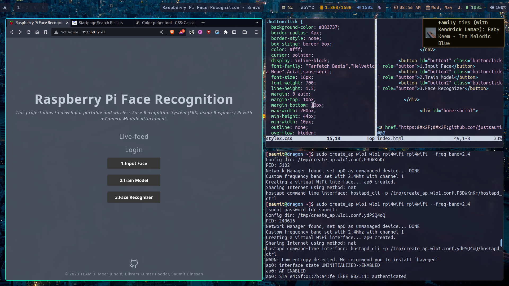
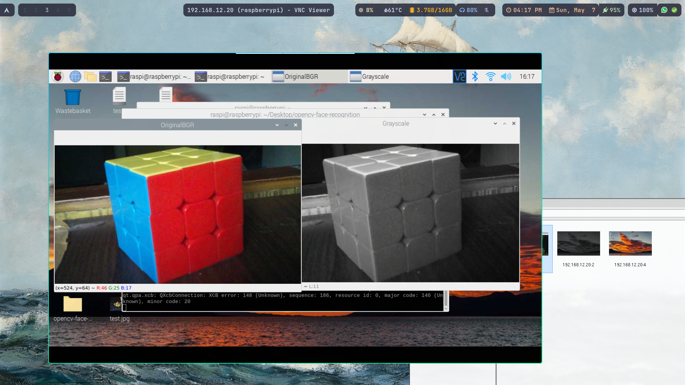
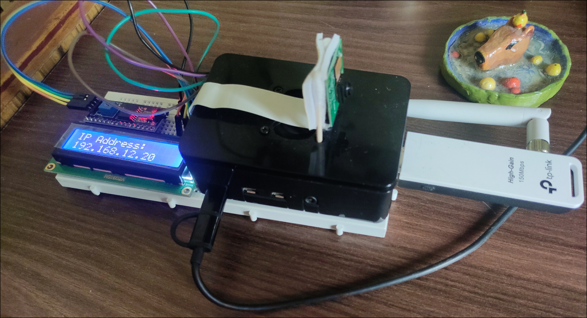

# Face Recognition using OpenCV with Raspberry Pi

## Introduction

My mini-project for college, which implements Face Recognition using OpenCV on Raspberry Pi 4. Using simple Haar-Cascade and LBPH.The goal is to create a portable solution that can be deployed as a wireless architecture allowing for flexible and convenient use in different environments.
This project aims to develop a **portable** and **wireless** Face Recognition System (FRS) using Raspberry Pi with a Camera Module attachment. The Raspberry Pi is powered using a power-bank, enabling the development of a portable facial recognition system.  
The project makes use of the **OpenCV** (Open-source Computer Vision) library, an open-source library for computer vision and machine learning tasks with contributions from more than a thousand developers.  
We chose to use cascade classifier method specifically Haar cascade object detection for facial detection over TensorFlow due to less complexity, moderate performance, lower system requirements, and better integration.

## Architecture



The Raspberry Pi acts as a wireless access point (WAP), connecting to it would allow developers and users to interact with their devices. Upon connecting with the network, it would be able to provide services such as SSH server, VNC server, and a Webserver. To access the system, developers can access the Raspberry Pi using the terminal using SSH, and VNC allows the system to be controlled remotely from a mobile device or a desktop computer. For the user side, they can view the live feed or access the database by logging in to a WebUI, which would lead them to an Authentication portal. This functionality provides cybersecurity by taking Security and Privacy Measures, ensuring that user data is protected and stored securely, and access is restricted to authorized personnel only.

## Flow

1. **Hardware Setup**: Connect a Raspberry Pi camera module to the Raspberry Pi board. We have a portable Face Recognition System consisting of Raspberry Pi 4B with a Camera Module. It is also connected to a Powerbank for power.
2. **Software Setup**: Install Required Libraries: Install the OpenCV library on the Raspberry Pi using the terminal command "pip install opencv-python".
3. **Networking Setup**: Enable Wireless Access Point configuration (IEEE 802.11) and run the services SSH on port 22, VNC on port 5900, and WebUI at port 80.
4. **Face Detection**: Load the Haar Cascade Classifier haarcascade_frontalface_default.xml file using the `cv2.CascadeClassifier()` function.
5. **Capture the Image**: Use OpenCV to capture the image from the Raspberry Pi camera module using the `cv2.VideoCapture()` function.
6. **Preprocess the Image**: Convert the captured image to grayscale using the `cv2.cvtColor()` function to improve the efficiency of the face detection algorithm.
7. **Detect Faces**: Use the `detectMultiScale()` function of the cascade classifier to detect faces in the grayscale image. It returns the coordinates of the bounding boxes.
8. **Display the Detected Faces**: Draw a rectangle around each detected face using the coordinates obtained and display the image using the `cv2.imshow()` function.
9. **View Recognized Faces**: The displayed detected faces can be viewed by VNC or WebUI using a live feed. Upon reaching the WebUI, users will be confronted with an Authentication portal allowing them to log in as either "admin" or "viewer" for Database management, and live-feed is accessible to all.
10. **Release Resources**: Release the video capture and destroy all windows using the `cv2.release()` and `cv2.destroyAllWindows()` functions, respectively.


## Progression



Initial trial, we utilized the HaarCascade classifier for face detection and trained the model using LBPH (Local Binary Patterns Histograms) recognizer.



The LCD 1602 I2C screen is used to display the local IP address of the Raspberry Pi.



This is the overall setup, which is completely wireless.


the image above displays the initial view of our web user interface (webui).

## TDL

- [x]  Port code from laptop to Raspberry Pi
- [x]  Rewrite code using PiCamera2 Library
- [x]  Make folder if it doesn't exist.
- [x]  Integrate Flask for WebUI.
- [x]  MJPEG Stream using Flask
- [ ]  Set up RPi as a WiFi client and access point.
- [ ]  Install hostapd - WiFi driver (Ubuntu packs in Raspi?)
- [ ]  Implement login authentication for admin and guest.
- [ ]  View, add, and remove users from the database.
- [ ]  Improve LBPH.

# Steps to Follow Post-Installation

## 1. Update and Upgrade Packages

``` bash
sudo apt update && sudo apt upgrade
```

## 2. Install dependencies

``` bash
sudo apt install -y python3-libcamera python3-kms++
sudo apt install -y python3-prctl libatlas-base-dev ffmpeg python3-pip
```

## 3. Update Firmware

After ensuring that the operating system and packages are all up-to-date, we can proceed with updating the firmware using:

``` bash
sudo rpi-update
```

Followed by a reboot:

``` bash
sudo reboot
```

**Note**: Updating the firmware carries some risks, and it's recommended to create a backup of your data before proceeding with the update (I recommend using sftp or rsync). I am doing this for better performance and stability of the camera module.  
I'm not enabling Legacy camera support in raspi-config as, for some reason, when it's enabled, it cuts off VNC, and instead of showing the display output, it shows ["Cannot currently show the desktop"](https://i.ytimg.com/vi/GnzRS3AgW5U/maxresdefault.jpg).

## 4. Enable VNC and LCD 16x2 Screen

### Enable I2C Interface and VNC

To enable the I2C interface on Raspberry Pi, follow these steps:

1.  Open the terminal on Raspberry Pi.
2.  Run the command:

``` bash
sudo raspi-config
```

3.  Select "Interfacing Options".
4.  Select "VNC".
5.  Select "Yes" to enable VNC.
6.  Select "I2C".
7.  Select "Yes" to enable the interface.
8.  Reboot the Raspberry Pi.

## 5. Testing the Camera

1.  Open the terminal on Raspberry Pi.
2.  Run the command:
``` bash
libcamera-hello
```
The command **libcamera-hello** will print a message to the console indicating that the libcamera library is working correctly, and then it will exit. It will show a glimpse on the screen of what is detected by the camera module and then exit; it will not capture and save any images.

3.  Point the camera module to a stationary object and then run the following command:
``` bash
libcamera-jpeg -o ~/Desktop/test.jpg
```
The command **libcamera-jpeg** will capture a still image using the camera module and save it to a specified location as a JPEG file.


**Test image taken by Raspberry Pi Camera Module** (Click on it for full-size)

## 6. Testing the Face-Recognition Application

To test the camera for the application, follow these steps:

1.  Clone the opencv-face-recognition repository from GitHub.
``` bash
git clone https://github.com/justsaumit/opencv-face-recognition
```

2. Change to the opencv-face-detection directory.
``` bash
cd opencv-face-detection
```

3. Change to the face-detection sub-directory.
``` bash
cd face-detection
```
4. Install the dependencies
System dependencies
``` bash
sudo apt install -y python3-libcamera python3-kms++ libcap-dev
```
**Note!:** libcamera won't work if you're using virtual environment since it's a lowlevel library that cannot be install using pip
Then pip dependencies
``` bash
pip install -r requirements.txt
```
OR Manually
``` bash
pip install opencv-python picamera2
```
**Note!** If you face error installing Picamera2 using pip make sure you have the following dependency installed:
``` bash
sudo apt install -y libcap-dev
```
If you still face error and unable to install, you may install opencv and picamera2 using apt with the following command:
``` bash
sudo apt install -y python3-opencv python3-picamera2
```
7. Change to the parent directory -opencv-face-recognition.
``` bash
cd ..
```
8. Run the "CamTest.py" script.
``` bash
python CamTest.py
```
Once the script starts running, it will use the Camera Module to show the captured frames in BGR and Greyscale.



**Output of running CamTest.py script**

9. Press 'Escape' key or 'q' key to quit and stop the script when you are done.

## 7. Install dependencies and test the LCD1602 LCD Display with I2C

1. Install the libraries and i2c-tools package
```bash
sudo apt install i2c-tools libi2c-dev
```
2. Enter the lcd-ipaddress-display subdirectory in this project
```bash
cd lcd-ipaddress-display
```
3. Install python modules `smbus` and `RPi.GPIO` to communicate with I2C devices using python scripts
```bash
pip install smbus RPi.GPIO
```
OR
```bash
pip install -r requirements.txt
```
4. Execute the python script to display Local IP Address:
```bash
python dispip.py
```
**Note:** The python script will only work correctly when it is located in the lcd-ipaddress-display directory, as the drivers directory is imported in the code as a library.



**Test image of LCD display in the setup showing the Local IP Address**

## Wireless Adapter

Command for checking whether driver for **Bus 001 Device 003: ID 2357:010c TP-Link TL-WN722N v2/v3 [Realtek RTL8188EUS]** wireless adapter is installed or not

```bash
lsmod | grep 8188eu
```

# Challenges faced
## Installing OpenCV on Raspberry Pi OS 32-bit
We initially tried installing opencv package using pip on our Laptop(x86_64 cpu architecture) and it worked, however doing the same on Raspberry Pi didn't work out because there were no pre-built binaries(for ARM) and in order to compile the wheel it would take alot of time and after waiting for couple of hours we would be met with a build error. 
We tried to resolve the errors and then waited more time for it to be done with compiling however we would face the same error regarding the wheel.
So after some research, reading a Raspberry Pi forum we found another approach, that is to use the 64-bit version of Raspberry Pi OS than using the 32-bit variant.
This also eliminated the step of updating mirror.
